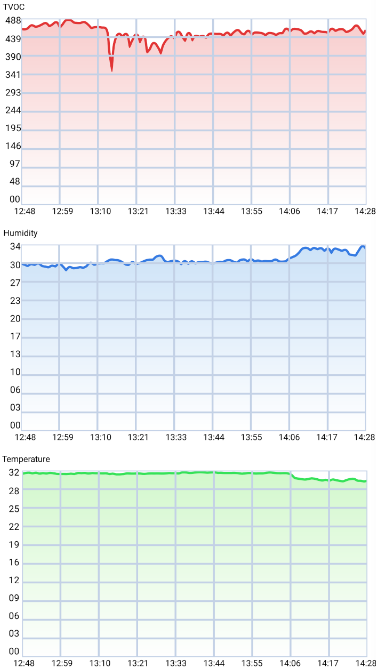

# CedChart.js
CedChart.js is a react-native module which renders a fully scalable Line Chart.




## Table of Contents
1. [Description](#Description)
2. [Installation](#Installation)
    1. [Dependencies](#Dependencies)
3. [Usage](#Usage)
    1. [Compulsory properties](#Compulsory-properties)
    2. [Color](#Color)
    3. [Second Color](#second-Color)
4. [Contributing](#Contributing)
5. [F.A.Q](#FAQ)

## Description
- The chart has two modes:
    - Data is fetched inside the module with axios get or post. The chart displays a loader during the fetch
    - Data is fetched outside the module and you can pass an array that has been fetched elsewhere.

- The x-axis can contain 24-hours value for the moment. The scale will adapt depending on the amount of data with more or less vetical strokes displaying.

- The y-axis will always display 11 adaptive values corresponding to 0, 10, 20, 30, ... , 100% of the data's max value.

## Installation
You can instlal the module through npm: https://www.npmjs.com/package/cedchart-rn

run ```npm install cedchart```

## Usage
You implement the chart by calling ```<CedChart />``` in your ```render()```

### Compulsory properties

- **Option 1** - You pass pre-fetched data to the Chart:
    You need 5 props: **data**, **timeUnit**, **valUnit**, **dataType** and **period**.
    - **data** must be an array of objects containing at least 2 different object with at least ```time:``` and  ```value:```   
    - **period** will determine the format of the date. Please indicate ```1d``` for 24-hour format, ```1w``` for day-of-the-week format and ```1m``` or ```3m``` for mm/dd format.

    *Example:* 
    ```
  <CedChart 
        data={[
            {
              time: '1570522315',
              value: '0',
            },
            {
              time: '1570522215',
              value: '100',
            },
          ]}
        dataType = {"temperature"}  
        timeUnit = {"time"}
        valUnit = {"value"}
        period = {"1w"} 
  />
    ```
  
 ### Color
 One additional property for your Chart is **color**. You can choose between 6 colors:
 - red
 - green
 - blue
 - orange
 - purple
 - pink 
  
  If not specified, the default color is blue.
 
 *Example:*
```
<CedChart
    data= {[...]}
    dataType = {"temperature"}
    timeUnit= {"time"}
    valUnit= {"value"}
    color= {"red"}
/>
```

  
  
 ### Second Color
 Another additional property for your graph is **secondColor**. This allows you to have a custom gradient color different from the main line color.
 The same colors as *color:* are available.
 
 If not specified, the default second color is the same as the main color.
 
 *Example:*
 ```
 <CedChart
     data= {[...]}
     dataType = {"temperature"}
     timeUnit= {"time"}
     valUnit= {"value"}
     color="pink"
     secondColor="orange"
 />
 ```
 
 
 ### Y Label
 **yLabel** is an additional property to label the y-axis.
 
 *Example:*
  ```
  <CedChart
      data= {[...]}
      dataType = {"temperature"}
      timeUnit= {"time"}
      valUnit= {"value"}
      yLabel= {"°C"}
  />
  ```
  
 
 ## Contributing
  Pull requests are welcome. For major changes, please open an issue first to discuss what you would like to change.
    
 ## FAQ
   #### Can I change the aspect ratio of the chart ?
   
   This Chart module has been thought to take the full width of the screen so please *Full compatibility cannot be guaranteed if you change the width ratio.* 
   
   The Chart should render nicely on any screen width so please open an issue stating your screen ratio if it does not. 

   You can adapt the height a little bit.
   
   #### Can I load multiple graphs on the same screen ?
   Yes you absolutely can.
